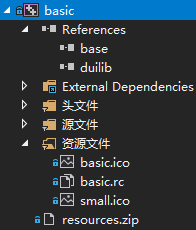
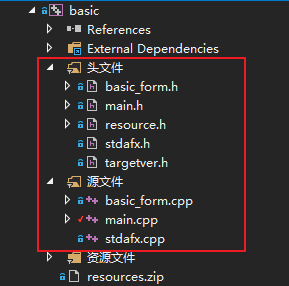
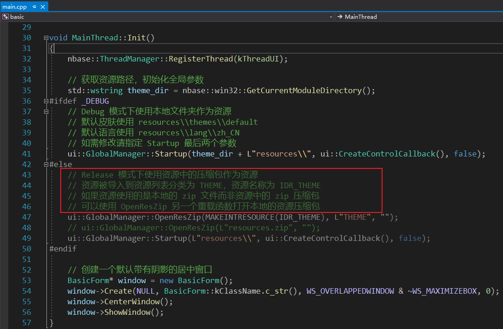

## 工程目录结构

如下图：



basic依赖于base和duilib两个工程。

### 代码


|文件名称       | 说明   
| :--------     | :-----
| basic_form.h  | 当前工程自定义的窗体类，继承自duilib的窗口基类 
| main.h          |  在这里定义了MainThread类，继承自base工程的FrameworkThread类，创建主循环
| resource.h        |
| stdafx.h          |
| targetver.h        |
|basic_form.cpp      |basic_form类的实现，加载xml路径、文件等
|main.cpp           |wWinMain函数。重写MainThread::Init()
|stdafx.cpp         |

### 代码浏览顺序
main.cpp

main.cpp中有三个函数：wWinMain()、MainThread::Init()、MainThread::Cleanup()

wWinMain()是入口函数，这里创建了主循环MainThread thread，MainThread在main.h中定义，继承自nbase::FrameworkThread，属于base工程。MainThread有个virtual类型的Init()函数，在main.cpp中被重写

MainThread::Init()，Init()函数在执行主线程循环中被调用，该函数加载了资源文件（用于定义窗体的xml等），创建了窗体BasicForm，BasicForm是当前工程创建的窗体类，在base_form.h和base_form.cpp中被定义。

MainThread::Cleanup()，清理函数

main.h

查看MainThread的详细定义

basic_form.h、basic_form.cpp

查看basic_form类的详细定义，下面几行代码是重点：
```c#
	/**
	 * 以下三个接口是必须要覆写的接口，父类会调用这三个接口来构建窗口
	 * GetSkinFolder		接口设置你要绘制的窗口皮肤资源路径
	 * GetSkinFile			接口设置你要绘制的窗口的 xml 描述文件
	 * GetWindowClassName	接口设置窗口唯一的类名称
	 */
	virtual std::wstring GetSkinFolder() override;
	virtual std::wstring GetSkinFile() override;
	virtual std::wstring GetWindowClassName() const override;
```


### 资源文件
在工程中有一个resources.zip的文件，该文件是basic工程的资源文件。
关于c++工程的资源文件的一些介绍：
https://github.com/feipeng8848/duilib_tutorial/tree/master/03_%E8%B5%84%E6%BA%90%E5%8E%8B%E7%BC%A9%E6%89%93%E5%8C%85

总结一下就是c++工程有多种加载资源的方案，可以直接把文件放到某个目录中也可以把整个目录压缩成zip文件。

basic工程在非debug模式下使用的zip方案，加载该资源文件的地方在main.cpp文件中：



ui::GlobalManager::OpenResZip() 函数是duilib/Core/GlobalManager.h中定义的。

而在dubug模式下（上图中）是直接加载程序所在目录的/resources目录下的资源文件。


